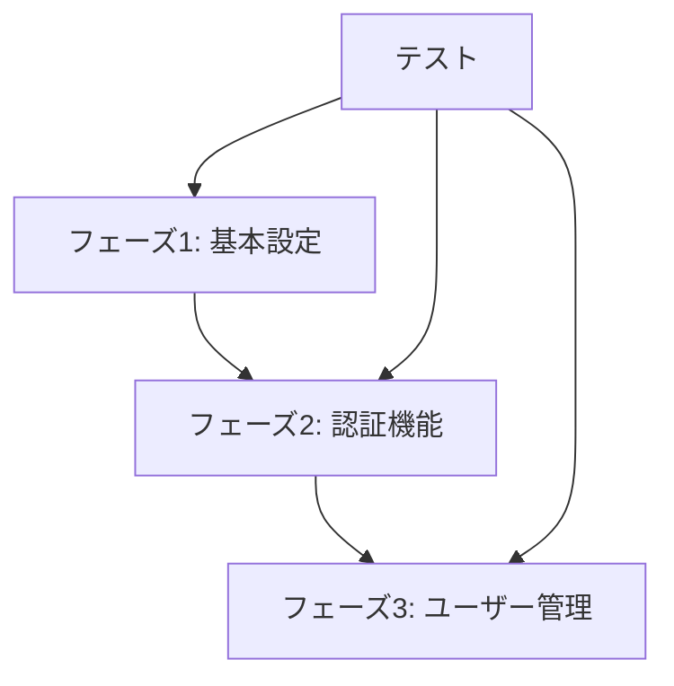

# AuthAPI 実装手順書

## 目次
1. [プロジェクト概要](#プロジェクト概要)
2. [環境設定](#環境設定)
3. [アーキテクチャ概要](#アーキテクチャ概要)
4. [実装フェーズ](#実装フェーズ)
5. [ドキュメント構成](#ドキュメント構成)

---

## プロジェクト概要

AuthAPIは、ASP.NET Coreを使用した認証・認可APIです。主な機能は以下の通りです：

- ユーザー認証（ログイン/ログアウト）
- ユーザー管理（登録/更新/削除）
- セッション管理
- 監査ログ

## 環境設定

### 必要な環境
- Visual Studio 2022 以降
- .NET 9.0 SDK
- Git
- 推奨拡張機能：
  - ReSharper
  - SonarLint
  - GitLens

### プロジェクト構成
```
AuthAPI/
├── src/
│   ├── AuthApi/                # メインプロジェクト
│   ├── AuthApi.Shared/         # 共通ライブラリ
│   └── AuthApi.Tests/          # テストプロジェクト
├── docs/                       # ドキュメント
└── scripts/                    # デプロイメントスクリプト
```

## アーキテクチャ概要

### 主要コンポーネント
1. **認証モジュール**
   - ユーザー認証
   - セッション管理
   - セキュリティ設定

2. **ユーザー管理モジュール**
   - ユーザーCRUD
   - 権限管理
   - 監査ログ

3. **共通モジュール**
   - DTO
   - ユーティリティ
   - 設定管理

## 実装フェーズ

実装は以下の3つのフェーズに分かれています：

1. **フェーズ1：基本設定**
   - プロジェクト構成
   - 依存性注入
   - 基本設定
   - [詳細はこちら](docs/phase1-basic-setup.md)

2. **フェーズ2：認証機能**
   - ユーザー認証
   - セッション管理
   - セキュリティ設定
   - [詳細はこちら](docs/phase2-authentication.md)

3. **フェーズ3：ユーザー管理**
   - ユーザーCRUD
   - 監査ログ
   - 検索機能
   - [詳細はこちら](docs/phase3-user-management.md)

### 実装の依存関係



## ドキュメント構成

### 技術ドキュメント
- [フェーズ1：基本設定](docs/phase1-basic-setup.md)
- [フェーズ2：認証機能](docs/phase2-authentication.md)
- [フェーズ3：ユーザー管理](docs/phase3-user-management.md)

### 運用ドキュメント
- [デプロイメント手順](docs/deployment.md)
- [運用ガイドライン](docs/operation.md)
- [トラブルシューティング](docs/troubleshooting.md)

### その他のドキュメント
- [API仕様書](docs/api-specification.md)
- [セキュリティガイドライン](docs/security-guidelines.md)
- [テスト計画](docs/test-plan.md)
